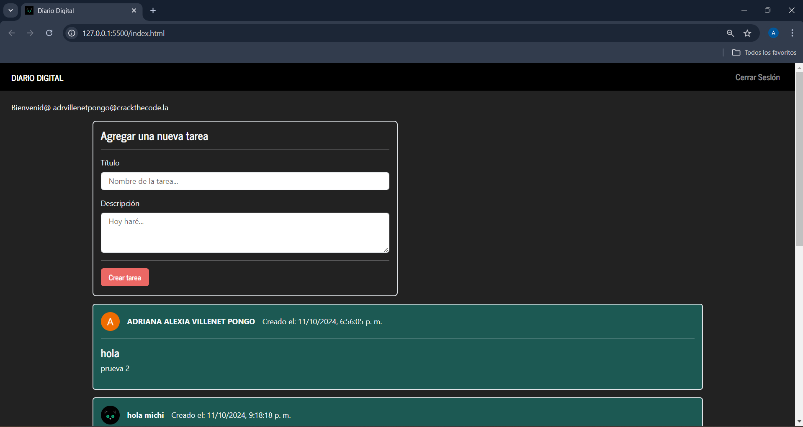

# 📝 DIARIO DIGITAL

Proyecto de ejemplo de la Unidad 4. Bootcmap +CHICAS TEC

## 📖 PRODUCTO FINAL 

> El diario digital fue todo un proceso largo e interezante o(*￣︶￣*)o

Lo más interezante de este ejemplo de proyecto fue aprender a iniciar sesión y registrarse; así como, crear cajas de tareas para comentar, editar y borrar; también, incluye la hora en el que se publicó.

